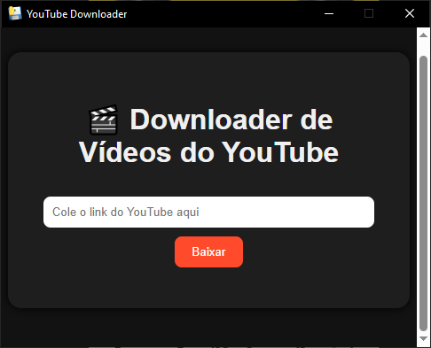

# 🎬 YouTube Video Downloader

Um aplicativo simples e leve para baixar vídeos do YouTube diretamente no seu computador.  
Desenvolvido em **Python + Web UI**, com interface moderna e intuitiva.  

---

Video Downloader (Python + Web UI)

Downloader de vídeos do YouTube (e de outros sites suportados pelo yt-dlp) desenvolvido em Python, utilizando uma interface web acessada diretamente pelo navegador. O projeto executa um servidor HTTP local que expõe uma API simples para download e uma interface HTML/JavaScript para interação com o usuário.

A opção por interface web elimina dependências gráficas nativas (GTK/Qt), garantindo compatibilidade com Python 3.13 e funcionamento consistente em Linux, Windows e macOS.

Características

Python 3.13 ou superior

Interface web (HTML, CSS e JavaScript)

Execução multiplataforma (Linux, Windows e macOS)

Sem uso de pywebview, GTK ou Qt

Backend simples baseado em biblioteca padrão + yt-dlp

Download no melhor formato disponível (preferência MP4)

Arquitetura clara e extensível

Arquitetura

O sistema é dividido em duas camadas bem definidas:

Backend Python
Responsável por executar um servidor HTTP local, receber requisições de download, invocar o yt-dlp e salvar os arquivos no diretório do usuário.

Frontend Web
Responsável por coletar a URL do vídeo, enviar requisições HTTP para o backend e exibir mensagens de status ao usuário.

Fluxo simplificado:

Navegador → Interface Web → HTTP (localhost) → Python → yt-dlp → Downloads

Requisitos

Python 3.13 ou superior

pip

Navegador moderno (Firefox, Chromium, Chrome, etc.)

Estrutura do Projeto

video_downloader/
main.py
README.md
requirements.txt
web/
index.html
styles.css
script.js
.gitignore
LICENSE

Instalação

Clone o repositório:

git clone https://github.com/profedney/video_downloader.git

cd video_downloader

Crie e ative um ambiente virtual (recomendado):

python3 -m venv venv
source venv/bin/activate

Instale as dependências:

pip install -r requirements.txt

Execução

Inicie o servidor:

python main.py

O navegador padrão será aberto automaticamente apontando para a interface web local. Caso isso não ocorra, acesse manualmente:

http://localhost:8765/web/index.html

Diretório de Download

Por padrão, os vídeos são salvos em:

~/Downloads

O nome do arquivo segue o título original do vídeo.

Observações Técnicas

Este projeto não utiliza interface gráfica nativa.
A escolha por interface web visa simplicidade, portabilidade e compatibilidade futura.
A arquitetura facilita a adição de novos recursos, como seleção de formato, download apenas de áudio, playlists, barra de progresso e empacotamento como AppImage ou PWA.

Licença

MIT, GPL-3.0

## 👨‍💻 Autor

**Prof. Edney Rossi**  
Professor, cientista e inventor.  
🎸 Músico e defensor da difusão livre do conhecimento.  

---

⭐ *Se gostou do projeto, deixe uma estrela no GitHub e compartilhe com seus amigos!*
